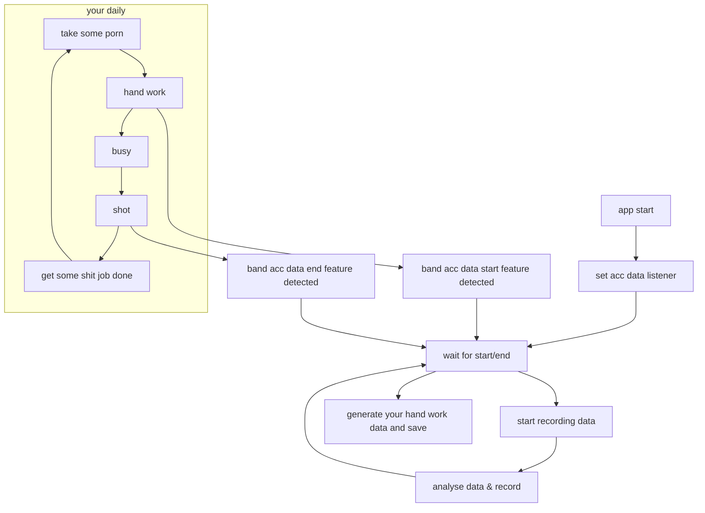

# 导管辅助

## 功能描述

通过手环陀螺仪和加速度计数据，检测导管状态，包括：

+ 基础功能
    + 记录时长、频率
    + 每次导管的数据记录，曲线分析
    + 周视图、月视图
+ 进阶功能
    + 频率调整建议(通过手环震动进行反馈)、寸止助手
    + 导管质量分析
    + 在线竞技、擂台

## 运行流程

## 开发平台

目前使用小米手环4的数据进行测试。软件通过安卓开发，在手机上运行。
